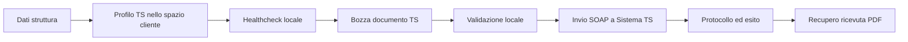
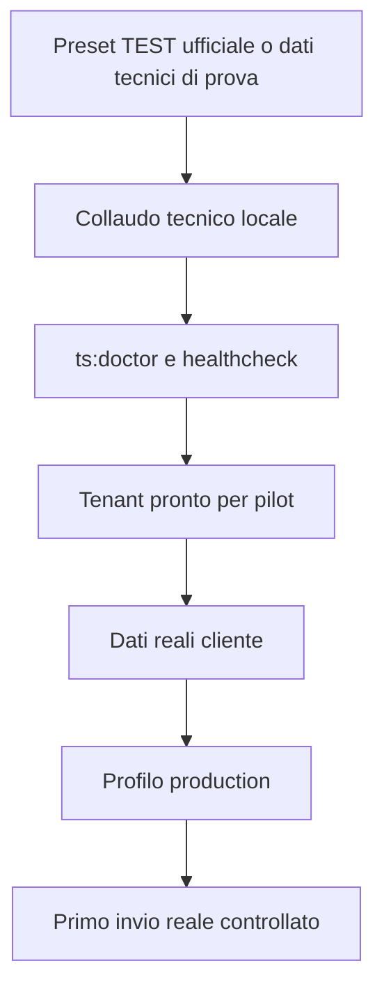

# Fatturazione TS onboarding cliente

## Obiettivo

Questo documento serve per portare un tenant dalla preparazione tecnica locale al primo uso reale del modulo `Fatturazione TS`.

Va usato quando:

- configuriamo un nuovo cliente
- riprendiamo un onboarding interrotto
- passiamo da `TEST` a `PRODUCTION`

## Vista rapida del processo

## Flusso ambienti

## Dati da raccogliere dal cliente

- tipo soggetto TS: `medico`, `struttura_autorizzata`, `struttura_accreditata`, `studio_associato`
- Partita IVA erogatore
- eventuale Codice Fiscale titolare, se usato dal soggetto
- username TS
- password TS
- PINCODE TS
- ambiente da usare: `test` oppure `production`
- se disponibili: `codiceRegione`, `codiceAsl`, `codiceSSA`

## Dati che possiamo preparare senza cliente

- feature `ts_billing` attiva sul tenant
- asset tecnici locali `WSDL`, `XSD`, certificato pubblico
- schema DB TS su `platform` e `tenant`
- collaudo tecnico con preset ufficiali `TEST`
- schermate di configurazione, documento, invio e ricevuta

## Checklist tecnica iniziale

1. verificare che il tenant corretto sia noto in `platform_tenants`
2. eseguire `php spark ts:doctor`
3. se mancano solo migration TS, eseguire `php spark ts:migrate-safe --scope=all`
4. aprire `spazio/fatturazione-ts` e salvare o aggiornare il profilo
5. lanciare l `healthcheck locale`
6. verificare che `Schema TS platform` e `Schema TS tenant` non abbiano errori

## Checklist collaudo TEST

1. usare un preset ufficiale `TEST` oppure credenziali di prova controllate
2. creare una bozza in `admin/fatturazione-ts/documenti/nuovo`
3. validare localmente il documento
4. inviare il documento al gateway `TEST`
5. verificare `protocollo`, `esitoChiamata` e timeline
6. recuperare la ricevuta PDF TS

## Checklist passaggio a production

1. sostituire nel profilo tenant i dati `TEST` con quelli reali del cliente
2. lasciare invariati asset tecnici e schema DB, salvo aggiornamenti ufficiali del kit TS
3. rieseguire `php spark ts:doctor`
4. rieseguire l `healthcheck locale`
5. confermare che il runtime locale punti al tenant giusto
6. pianificare il primo invio reale in una finestra controllata

## Verifiche post go-live

- il documento finisce in stato `sent`
- il protocollo TS viene salvato sul record
- la ricevuta PDF viene archiviata in `writable/tenants/<storage_key>/ts/receipts/...`
- non restano errori locali o drift tecnico bloccante nell’healthcheck

## Note pratiche

- il modulo può essere preparato quasi interamente senza toccare subito credenziali reali del cliente
- il collaudo tecnico con preset `TEST` non sostituisce il go-live con il soggetto obbligato reale
- i codici `tipoSpesa` marcati come `Descrizione prudente` sono comunque codici validi nel tracciato TS: va solo confermata meglio la semantica business sul primo caso reale
